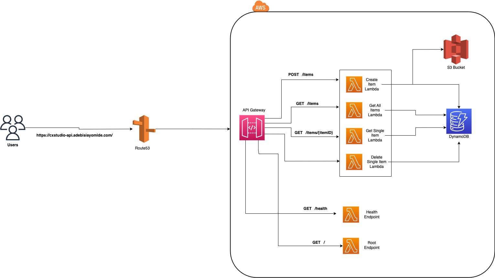

# CDK Typescript Challenge CX Studio

After deploying the stack , i added a custom domain for the serverless application

#### API Base URL : 
i connected the api to my personal custom domain
https://cxstudio-api.adebisiayomide.com

#### API Documentation (Postman): 
https://documenter.getpostman.com/view/8590260/2s9Y5YSheV


#### Dynamodb DB Table viewer : 
This allows you to preview the items stored in the dynamodb table.
https://r7wr6p8fik.execute-api.ap-southeast-2.amazonaws.com/prod/

#### CICD Pipeline : 
I had some extra time , so i decided to add a CICD pipeline for automated unit tests and integration tests
- View cicd pipeline here 

#### Infrastructure Diagram: 
This is the visual representation of the whole serverless stack, I hope it explains the application flow 



## Note for the create api
The image is converted into a base64 image before being sent to the the endpoint
```
curl --location 'https://cxstudio-api.adebisiayomide.com/items' \
--header 'Content-Type: application/json' \
--data '{
  "username": "cx-admin",
  "fileName": "samplefile.js",
  "fileContent": "aW1wb3J0IHsgU3RhY2ssIFN0YWNrUHJvcHMgfSBmcm9tICJhd3MtY2RrLWxpYiI7CmltcG9ydCB7IENvbnN0cnVjdCB9IGZyb20gImNvbnN0cnVjdHMiOwpleHBvcnQgZGVjbGFyZSBjbGFzcyBDeFN0dWRpb1N0YWNrIGV4dGVuZHMgU3RhY2sgewogICAgY29uc3RydWN0b3Ioc2NvcGU6IENvbnN0cnVjdCwgaWQ6IHN0cmluZywgcHJvcHM/OiBTdGFja1Byb3BzKTsKfQo="
}'
```

### How to run and deploy the infrastructure stack locally

- 1. Clone this repository
- 2. Install the aws cdk toolkit locally `npm install -g aws-cdk`
Follow the other Perecusites listed here to set up your local system https://cdkworkshop.com/15-prerequisites/500-toolkit.html
- 3. Run `npm run build` to build your stack and compile typescript to js
- 4. Run `npm run test` to tun the unit tests created for the stack
- 5. Run `cdk synth` to emit the synthesized CloudFormation template
- 6. Run `cdk deploy`  to  deploy this stack to your default AWS account/region

Running `cdk deploy` would deploy ths stack and output the api endpoint fot both the Rest API and Dynamodb table viewer

## TODO
- Add some extra parameter validations
- Write snapshot tests for the stack

